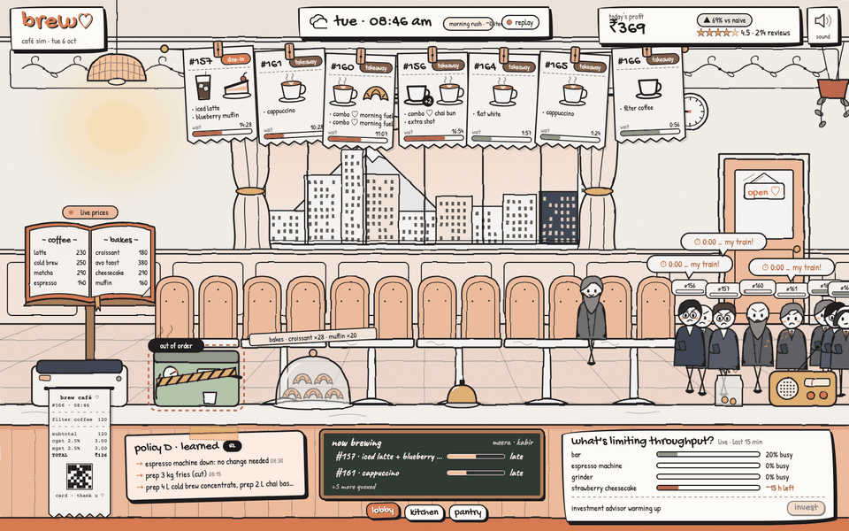
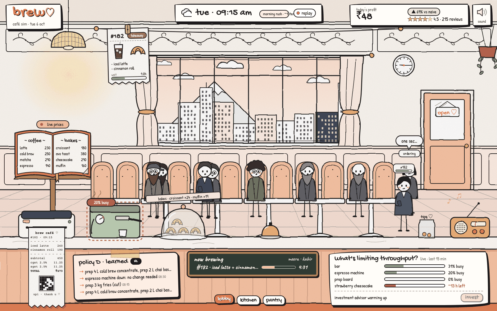
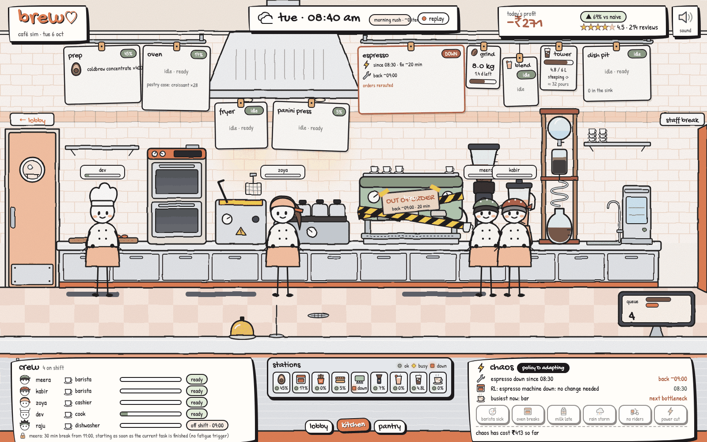
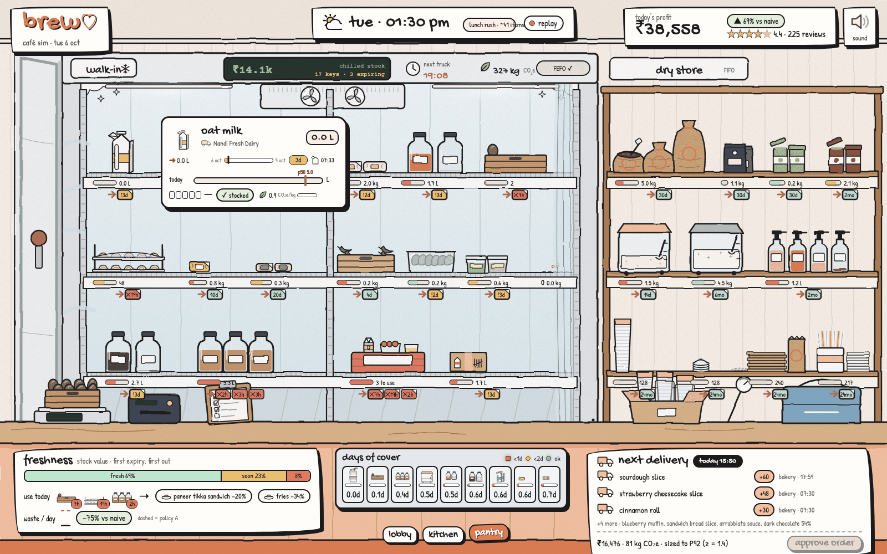
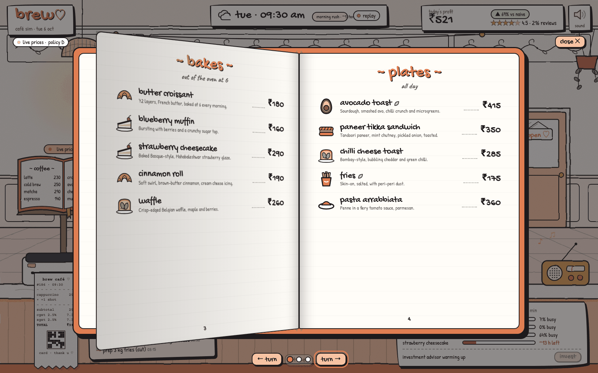
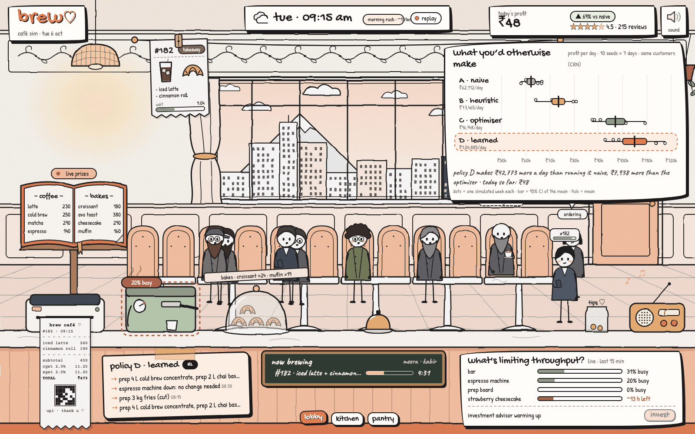
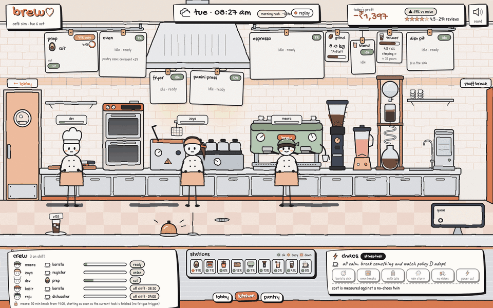
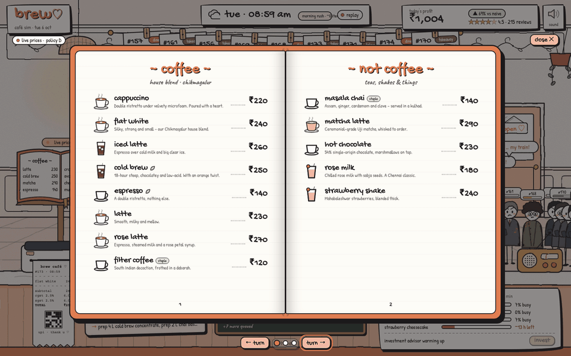

<div align="center">

# brew ♡

**A cosy little café that happens to be an ML system.**

brew runs a live, real-time digital twin of an independent café and lets a learned manager run it: what to prep,
what to charge, what to cook first, what to rescue before it's thrown away. Every number on screen comes from the
simulation as it happens, and every claim below comes from paired, seed-controlled experiments.




[technical deep-dive](technical.md) · [backend spec](backend.md) · [master plan](plan.md)

</div>

---

## Why this exists

An independent café solves a hidden optimisation problem every minute: how much cold brew and croissant dough to
prep ahead, what to charge when it rains or a delivery app floods in, which ticket to cook first and which three oat
lattes to steam together, whether to accept one more Zomato order while the espresso machine is already at 94 %,
how to rescue food before it's binned, and how to staff without burning people out.

Chains have operations-research teams for this. Independents run on gut feel. brew is a laptop-sized decision system
for them. You can't A/B test four management styles on the same Tuesday morning in a real café, but you can in a
faithful twin with **common random numbers**: the same customers walk in, order the same things and lose patience at
the same moments, and only the manager changes. That turns "the learned policy makes more money" into a causal
statement.

## Screens

| | |
|---|---|
|  |  |
| **Lobby**: the ticket rail, batch paperclips, procedural customers with patience bars, the decision card and the bottleneck card with a real "invest" button. | **Kitchen in chaos**: the espresso machine is down, the technician is on the way, the RL manager's immediate re-plan shows on the chaos card. Six chaos buttons hit the live API. |
|  |  |
| **Pantry**: every lot with its freshness, FEFO arrows, days of cover, the waste chart against naive, and the policy's own purchase order to approve. | **Menu book**: flies off the lectern with real 3D page turns; live prices are struck through in ink and rewritten; meal combos and the rescue shelf have their own spreads. |
|  |  |
| **What you'd otherwise make**: click today's profit and it unfolds into D vs A/B/C: one dot per simulated week, 95 % CI of the mean. | **Chaos, live**: the machine breaks at 08:30, the station LEDs and crew react, the re-plan lands within seconds. |

<div align="center"></div>

## The decision stack

```
  ┌──────────────────────────────────────────────────────────────┐
  │  live UI   hand-inked lobby · kitchen · pantry · menu book   │  WebSocket, 71 typed events, since_seq resume
  └──────────────────────────────▲───────────────────────────────┘
  ┌──────────────────────────────┴───────────────────────────────┐
  │  shield / charter   fair-pricing bounds, staples, breaks     │  every action is checked, 422 on violation
  └──────────────────────────────▲───────────────────────────────┘
  ┌──────────────────────────────┴───────────────────────────────┐
  │  D · the RL manager   MaskablePPO → ONNX, every 15 sim-min   │  prices, prep, dispatch, throttle, Replate
  └──────────────────────────────▲───────────────────────────────┘
  ┌──────────────────────────────┴───────────────────────────────┐
  │  C · operations research   CP-SAT kitchen schedule,          │  newsvendor prep, pricing LP, capacity
  │                            shadow prices                     │
  └──────────────────────────────▲───────────────────────────────┘
  ┌──────────────────────────────┴───────────────────────────────┐
  │  forecasts   LightGBM quantile demand (P10/P50/P90),         │  weather, daypart, delivery-app surges
  │              usage via the bill of materials                 │
  └──────────────────────────────▲───────────────────────────────┘
  ┌──────────────────────────────┴───────────────────────────────┐
  │  digital twin   discrete-event café: customers with personas │  CRN seeds, forks for counterfactuals
  │  and patience, stations, staff fatigue, lots, riders, chaos  │
  └──────────────────────────────────────────────────────────────┘
```

**Design principles**

- **Measure, don't assert.** Every comparison is CRN-paired on held-out seeds, with bootstrap CIs, a Wilcoxon test
  and the worst-day CVaR, not just the mean.
- **Live, not a playback.** The café runs on the wall clock (Asia/Kolkata); things happen every few seconds, like a
  real morning. Tap the clock to fast-forward (5×, 20×, 60×) when you want to see a whole day; from then on that
  café runs ahead of real time.
- **Explainable by construction.** Every decision carries a headline and a trigger, and `/decisions/{id}/explain`
  says why.
- **One hand drew it.** Wobbly ink, paper grain, one motion vocabulary; every sound is synthesised, with no samples.

## Highlights

- **Replate rescue shelf**: food near its use-by is marked down in steps instead of binned: −53 % waste and
  +₹351/day on policy C, measured with forked worlds.
- **Meal combos** priced and featured by the manager, within the fairness charter.
- **Chaos you can press**: barista sick, oven breaks, milk delivery late, rain storm, rider shortage, power cut. Each
  one triggers an immediate re-plan, and a shadow fork without the disruption prices the cost of chaos.
- **An investment advisor** that runs counterfactual forks ("a second espresso machine pays back in N days"), and
  an invest button that spends real sim cash. The item then shows up in the room.
- **Resilient client**: since_seq resume, jittered backoff, re-hydration when the server restarts, a labelled
  offline replay. Kill the backend mid-rush and the page waits, then recovers with no duplicate tickets.
- **Feels like a game**: Web Audio sound design with ducking and a generative lo-fi bed, focus zooms, parallax, and
  p95 frame time ≤ 16.7 ms in the kitchen and pantry (static art baked to bitmaps once). It's axe-clean, fully
  keyboard operable, and captions are available.

## Results

Final arena: 10 seeds × 7 days, `weekday_normal`, CRN-paired, held-out seeds. All figures are per day.

| | A · naive | B · heuristic | C · optimiser | **D · learned** |
|---|---:|---:|---:|---:|
| Mean profit | ₹62,112 | ₹73,465 | ₹96,948 | **₹104,885** |
| Δ vs A (95 % CI) | — | +11.4k [8.7k, 13.9k] | +34.8k [31.5k, 38.3k] | **+42.8k [38.5k, 47.3k]** |
| Win rate vs A (Wilcoxon p) | — | 10/10 (0.002) | 10/10 (0.002) | **10/10 (0.002)** |
| CVaR 10 % (worst days) | ₹10,357 | ₹25,974 | ₹64,075 | **₹66,037** |
| Waste | 41.3 kg | 23.9 kg | **6.4 kg** | 10.4 kg |
| SLA breach | 13.9 % | 13.5 % | 11.1 % | **8.8 %** |
| Walk-outs | 119 | 112 | 72 | **65** |
| Rating | 4.43 | 4.42 | 4.40 | 4.39 |

**Honest read.** D wins on throughput and service: the most revenue, the fewest late orders and walk-outs, and the
best worst day. It learned to trade prices, prep and dispatch *jointly* through the day, which C optimises separately
and myopically. D does **not** win on waste: it throws away 4 kg/day more than C, whose newsvendor is explicitly
waste-averse, because D judged the extra prep worth it for speed. A higher waste weight or the next robust-RL round
should close that gap. Ratings are flat across all four. The full metrics are in
[`docs/training/full-20261005/`](docs/training/full-20261005/), and the story is told in [technical.md §9](technical.md).

## Quickstart

**Docker (one command).** The image is built with uv from the lockfile and starts the API, the WebSocket stream and
the frontend together:

```bash
docker compose up --build                # → http://localhost:8000/  (the café as it is right now)
```

```bash
BREW_LIVE_RATE=20 docker compose up      # 20× faster for a rehearsal; open http://localhost:8000/?clock=open
```

```bash
BREW_HOURS=07:00-24:00 docker compose up # open 7 am to midnight: try the café late at night
```

```bash
docker compose run --rm brew uv run brew-eval --help   # any brew CLI inside the image, through uv
```

The SQLite database and training runs live on the `brew-data` volume (`/var/lib/brew`). The image carries CPU torch,
since the server runs policy D on ONNX and never needs a GPU.

**Local (uv).**

```bash
git clone <this repo> && cd Brew && uv sync
brew install libomp                      # macOS: LightGBM needs it
uv run brew-api                          # → http://localhost:8000/
```

- `http://localhost:8000/` shows the café as it is right now, run by policy D.
- `?clock=open` starts the day at 07:00 instead of the wall clock; `&world=<id>` attaches to an existing world.
- `?fps` shows a frame-time overlay.
- With no backend, the page plays a recorded morning, labelled as a replay, and switches to live when the server
  wakes.
- For a fast café: `BREW_DB_ENABLED=0 BREW_LIVE_RATE=60 uv run brew-api`.
- Other opening hours: `BREW_HOURS=07:00-24:00 uv run brew-api`. This applies to live worlds only (the crew and demand stretch to fit); the tests, training and arena keep the café's real 08:00–22:00, which is what policy D was trained on.

```bash
uv run pytest -q                                   # backend + frontend (Playwright, headless Chromium)
uv run ruff check . && uv run mypy src
uv run python scripts/capture_readme_media.py      # regenerate everything in docs/images/
```

## Keys

<kbd>1</kbd> <kbd>2</kbd> <kbd>3</kbd> lobby · kitchen · pantry · <kbd>←</kbd> <kbd>→</kbd> walk between rooms ·
<kbd>m</kbd> menu book · <kbd>f</kbd> or a tap on the clock: fast-forward (1× → 5× → 20× → 60×; once it runs fast the
café leaves the wall clock behind) · <kbd>esc</kbd> close / zoom out · <kbd>?</kbd> the keys card.

## Easter eggs

The café hides fifteen small things. Nothing is labelled, none of them touch the simulation, and you get a quiet
"🥚 3 of 15" each time you find one (kept in your browser's `localStorage`, key `brew.eggs`). The list is behind the
spoiler, so try finding them first.

<details>
<summary>spoilers ♡</summary>

| # | where | how | what happens |
|---|---|---|---|
| 1 | lobby window sill | look on one day in four (seeded by the sim's date), or after closing; or type `biscuit` | **biscuit**, the café cat, naps there. Click her: she purrs, opens her eyes and stretches, and a few hearts float up |
| 2 | lobby wall clock | click it three times quickly | a **cuckoo** pops out and calls the hour (sim time) |
| 3 | lobby tip jar | click it | a coin drops in with a clink. The jar **remembers** your tips; 10, 50, 100 and 500 get a thank-you |
| 4 | lobby radio | click it | static, then a **new station**: 92.7 brew fm (the house lo-fi), 98.3 monsoon fm (slow and minor), 104.8 chai-time fm (bright and swingy). The music bed really changes |
| 5 | anywhere | the Konami code <kbd>↑</kbd><kbd>↑</kbd><kbd>↓</kbd><kbd>↓</kbd><kbd>←</kbd><kbd>→</kbd><kbd>←</kbd><kbd>→</kbd><kbd>b</kbd><kbd>a</kbd> | **barista mode**: a chiptune jingle, the logo wiggles, and coffee-and-hearts confetti |
| 6 | anywhere | type `chai` | a kettle whistles and a clay **kulhad** of chai steams on the counter for a minute |
| 7 | anywhere | type `upi` | toggles the **UPI soundbox voice**: like every Indian counter, it announces "₹415 received" after the payment chime |
| 8 | kitchen, by the cold-brew tower | click the yellow thing | a **rubber duck** squeaks and hops. Every seventh squeak it reminds you who hears all the bugs |
| 9 | pantry, the baseboard between the walk-in and the dry store | wait for it to peek out, then click | a **mouse** bolts back into its hole. You didn't see anything |
| 10 | the ♡ in the logo | click it | it beats, and the tagline cycles ("made with ♡ and math", "MaskablePPO on espresso", …) |
| 11 | the menu book | press <kbd>s</kbd> while it's open | a sticky note with the **secret menu** (dirty chai; "the biscuit") |
| 12 | lobby window | be there at 11:11 (sim time, am or pm) | a **shooting star**: make a wish. Fast-forward helps |
| 13 | anywhere | switch rooms six times in three seconds | the logo gets **dizzy** and spins |
| 14 | the browser tab | leave it for a minute and a half | the tab title frets that your latte's getting cold, and the café **welcomes you back** |
| 15 | lobby, on special sim dates | 1 Oct, Diwali, 24–25 Dec | **festive dressing**: coffee-day bunting, a marigold toran with flickering diyas, a Santa hat on the order bell |

And for anyone who opens devtools, there's a hand-drawn cup and a hint in the console. Find all fifteen to be named
head barista.

</details>

## Repository layout

```
Dockerfile       uv-built image (locked deps, CPU torch) · docker-compose.yml with the brew-data volume
src/brew/        sim (digital twin) · policies A–E · forecast · opt (CP-SAT, LPs) · rl · api (FastAPI + WS)
design/          the frontend: brew.html, lobby / kitchen / pantry / menu / hud, camera, audio, a11y
design/live/     client layer: bus, pure store + reducers, WsSource / ReplaySource, REST polling, boot
models/          the ONNX champion (models/rl_policy/D/full-5033b06) and forecasters
tests/           backend suites; tests/frontend (contract, store, render, e2e, visual, perf, a11y, resilience)
docs/            training logs, the implementation spec, handoffs, README media
```

## Docs

- [`plan.md`](plan.md): master plan, scope and the demo script.
- [`technical.md`](technical.md): the judges' deep-dive (simulator, forecasts, OR, RL, evaluation).
- [`backend.md`](backend.md): the product and API spec, with every event and the visual it drives.
- [`docs/implementation-spec.md`](docs/implementation-spec.md): the low-level spec the code was built from.
- [`design/live/README.md`](design/live/README.md): the client-layer contract.
- [`tests/frontend/README.md`](tests/frontend/README.md): what each frontend test pins down.
