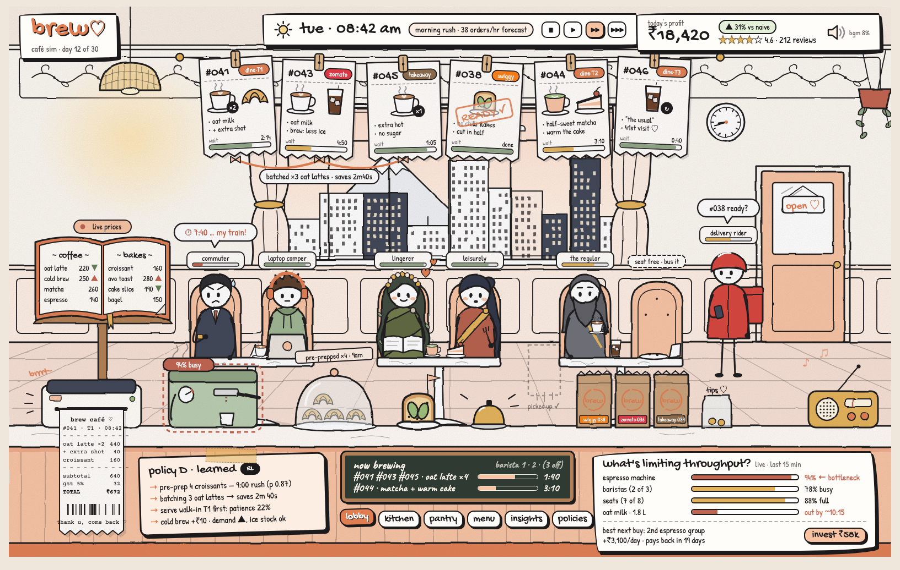
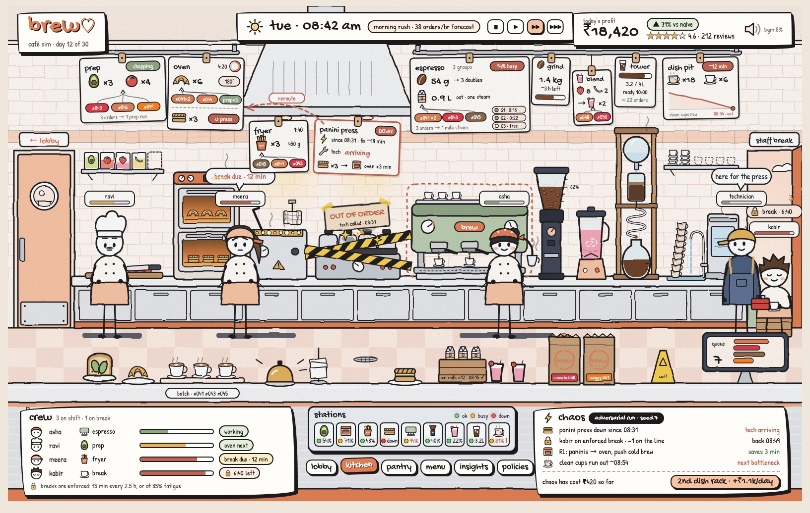
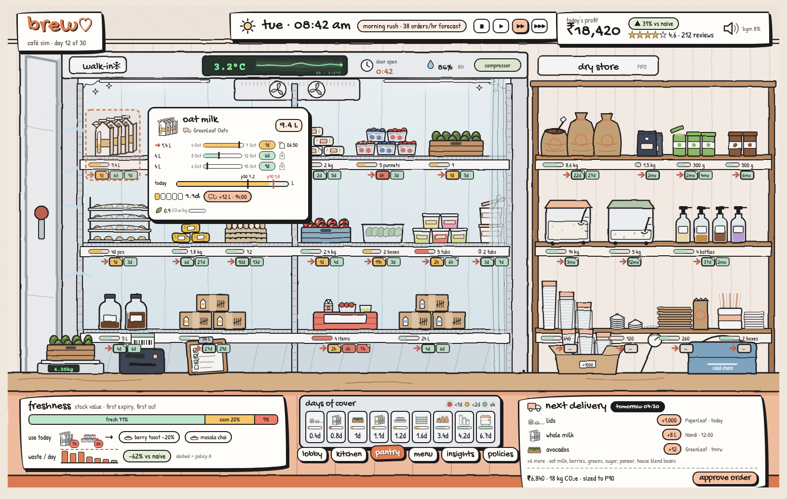

# Brew: master plan

> **Status:** v2.0 · 2026-10-06 · rewritten from scratch for the current scope.
> **This is the single source of truth.** Every agent reads this file first. Where it points at a companion doc, that doc owns the detail.
>
> | Doc | Owns |
> |---|---|
> | `plan.md` (this file) | Vision, scope, experience, art direction, architecture, roadmap, working rules |
> | `backend.md` | Backend product spec: domain, policies, Replate (§3.11), meal combos (§3.12), REST/WS contract (§6), event list (§6.3) |
> | `technical.md` | Implementation spec and judges' deep-dive on the simulator and ML/RL (being rewritten; read it for facts) |
> | `context.md` | Session handoff log and history, including the older roadmap |
> | `frontend-backend-integration.md` | *(to be written)* test suite first, then WS client, hydration, actions, event-to-visual coverage |
> | `polish.md` | *(to be written)* sound, transitions, camera moves, performance budget, accessibility, offline states, showcase README |
>
> **Precedence:** `backend.md` wins over this file on backend behaviour and the event contract. This file wins on scope, UX and sequencing.

---

## 1. TL;DR

**brew** is a digital twin of an independent café in Indiranagar, Bengaluru, wrapped in a hand-inked, playable 2D café. A discrete-event simulator drives every customer, ticket, dish, lot of milk and rupee. A **learned RL manager (Policy D)** runs the café and is shown to beat three baselines on profit, while cutting waste and respecting fair-pricing and staff-wellbeing rules.

- **Live, not replay.** The café runs in real time (`BREW_LIVE_RATE` = 1.0). There are no playback speeds. A `clock: "wall"` world starts on today's date, synced to the real local time in Asia/Kolkata. Controls are play, pause and step.
- **Three screens:** **lobby, kitchen, pantry**, on one sliding track, under one shared HUD. The lobby holds the **menu book**; the HUD holds the **profit component** that expands into the D vs A/B/C comparison.
- **Backend is done and tested** (Python 3.12, uv, FastAPI + WebSocket, about 330 tests, ruff and mypy clean). Policy D is trained and committed.
- **Frontend is final in design but static or mocked.** Nothing on screen is wired to the backend yet. That is the main job left.
- **Headline result** (10 seeds x 7 days, same customers for every policy): **A Rs 62.1k, B Rs 73.5k, C Rs 96.9k, D Rs 104.9k profit per day.** D beats C by 8% and A by 69%.
- **What is left:** (1) a test suite, (2) frontend-backend integration, (3) polish, (4) demo packaging, (5) optional ML follow-ups. See §12.

**Stack:** Python 3.12 managed with **uv** · FastAPI + WebSocket · SQLite by default (Postgres optional) + Parquet/DuckDB · custom discrete-event simulator · LightGBM quantile forecasts · OR-Tools (CP-SAT, LP) · Gymnasium + Stable-Baselines3 / sb3-contrib (MaskablePPO) · ONNX runtime for D · vanilla HTML/CSS/JS with hand-drawn SVG, no framework.

---

## 2. Goals and success criteria for the demo

### 2.1 Goals

| # | Goal | How the demo shows it |
|---|---|---|
| G1 | A learned policy earns more than naive, heuristic and optimiser baselines | The profit component in the HUD: click it, see D vs A/B/C ("what you'd otherwise make") from the same live day |
| G2 | The AI's decisions are visible and understandable | Every decision shows as an animation and a handwritten "why" note (policy D card, price reasons in the menu book) |
| G3 | It stays robust when things break | Press chaos (panini press down, barista sick): the café visibly re-plans, the chaos card prices the damage |
| G4 | It turns waste into money | Replate: pre-made food nearing its use-by moves to the rescue shelf at falling prices; pantry waste/day vs naive |
| G5 | It tells the owner what to buy | Bottleneck card with a best-next-buy suggestion; newsvendor-sized delivery with an approve button |
| G6 | It feels like a crafted game | One consistent hand-inked style, every number and animation caused by a real event |

### 2.2 Definition of done (demo)

All of these hold on a clean checkout, with no internet beyond the Google Fonts request (fonts are vendored in the packaging phase):

1. `uv run brew-demo` (one command) starts the API, creates a wall-clock world, serves the frontend and opens the browser.
2. The lobby shows real customers walking in, real tickets on the rail, batches clipped, receipts printing, bags picked up by riders. **No `Math.random` drives anything the user sees.**
3. The menu book's prices change live with a handwritten reason; combos reprice from their components; the rescue shelf shows real Replate listings.
4. The kitchen shows real station, staff-fatigue and equipment state. Pressing a chaos button breaks a station and the reaction comes from the backend.
5. The pantry shows real lots with FEFO, freshness, forecast P50/P90, days of cover and the next delivery.
6. The profit component expands to the D vs A/B/C comparison with real numbers.
7. If the backend drops, the UI shows a clear reconnect state, then hydrates from `/state` and resumes from `since_seq` with no visual glitches.
8. A 3-5 minute scripted demo (§9) runs end to end without touching anything outside lobby, kitchen and pantry.
9. 16 ms per frame on an M2 MacBook (8 GB) during a 30-minute live run, with no memory growth.

### 2.3 Non-goals (see §13 for the full list)

No Policy Arena page, no back office, no onboarding, no voice, no LLM chat, no customer QR page, no multi-café, no POS-CSV calibration, no live weather, no real Zomato/Swiggy integration, no payments, no real PII.

---

## 3. The experience, screen by screen

One canvas, 1600 x 1000 design units, scaled to fit the window (max width 1600). Three **rooms** sit side by side on a single track. Choosing a room tab (or pressing a key) slides the track; the HUD stays put. Everything is hand-inked SVG with HTML cards layered on top.

```
          lobby                 kitchen                 pantry
   +----------------+     +----------------+     +----------------+
   |  ticket rail   | --> |  stations      | --> |  walk-in fridge|
   |  customers     |     |  crew          |     |  dry store     |
   |  menu lectern  |     |  chaos card    |     |  freshness bar |
   +----------------+     +----------------+     +----------------+
   ======== shared HUD: logo · clock/weather · profit · rating · bgm · room tabs ========
```

### 3.1 Shared HUD

Persistent across all rooms.

| Element | Content | Source (backend) |
|---|---|---|
| Logo + day line | "brew", cafe name, day | `/state`, `day.started` |
| Clock + weather | Real local time (Asia/Kolkata), weather icon, temp, a forecast chip such as "morning rush · 38 orders/hr forecast" | `clock.tick`, `weather.changed`, `/forecast` |
| Controls | **Play, pause, step.** The mock's 1x/10x/60x speed buttons are removed: the café is live | `POST /worlds/{id}/control` |
| **Profit component** | "today's profit", delta chip vs naive, rating stars with review count. **Click to expand** (§3.5) | `kpi.tick`, `review.posted`, `/arena` data |
| Sound | bgm toggle and volume | local |
| Room tabs | lobby · kitchen · pantry (and a "menu" tab that opens the book) | local |

The old mock tabs "insights" and "policies" are removed: those screens are out of scope (the policy comparison lives in the profit component).

### 3.2 Lobby: the front of house (hero screen)



What is on screen, and what drives it:

| Piece | Behaviour | Events |
|---|---|---|
| **Ticket rail** | Paper tickets with items, modifiers, a channel stamp (dine-in, takeaway, Zomato, Swiggy as plain text stamps, never logos), and a wait bar. Tickets slide in, reorder with FLIP when priority changes, tear off when served | `order.placed`, `order.progress`, `rail.reordered`, `order.served`, `order.voided` |
| **Batch paperclip** | Tickets cooked together get one pink paperclip and a "x3" badge | `batch.formed`, `batch.started` |
| **Customers** | Hand-drawn people with persona tags (commuter, student, ...) and patience bars that drain to red. Speech bubbles when ordering. Walk-outs leave a huff cloud | `customer.arrived/queued/ordering/waiting/patience/seated/eating/left/balked/reneged` |
| **Menu lectern** | Stand-up book. Click it, or the "menu" tab, and the book flies to full view (§3.3) | `price.changed`, `menu.*`, `replate.*` |
| **Thermal receipt printer** | Prints itemised GST receipts line by line (Courier Prime) | `receipt.printed` |
| **Espresso machine** | Busy % tag from real utilisation | `task.*`, `kpi.tick` (`load_pct`) |
| **Pastry case** | Finished-goods stock; green "replate" tags on items on the rescue shelf | `stock.changed`, `replate.listed` |
| **Delivery bags and rider** | Kraft bags on the shelf with rider ETA; a rider arrives and picks up; quality fades if bags wait | `bag.shelved`, `rider.assigned/arrived/picked_up` |
| **Door** | Opens as customers arrive and leave | `customer.arrived`, `customer.left` |
| **"policy D · learned" decision card** | Latest decision in plain words, from the surrogate-tree explainer | `decision.made`, `/decisions/{id}/explain` |
| **"now brewing" KDS board** | Columns brewing, almost, ready | `order.progress`, `order.ready`, `/board` |
| **"what's limiting throughput?" card** | The binding resource with its utilisation and a **best-next-buy** suggestion from the investment advisor | `bottleneck.changed`, `/bottlenecks`, `/advisor` |

### 3.3 The menu book (built in `design/menu.js`)

Click the lectern or the "menu" tab: the book lifts off its stand, grows to fill the view and opens. Pages turn in 3D (buttons, arrow keys, click on the page edge, swipe).

- **Live prices.** When a price changes, the old price gets an **ink strike-through**, the **new price is handwritten in**, and a small note gives the reason ("kitchen 92% · 34C"). The chip arrow shows direction.
- **Spreads:**

| Spread | Left page | Right page |
|---|---|---|
| 1 | coffee | not coffee |
| 2 | bakes | plates |
| 3 | **meal combos** | **rescue shelf** |

- **Meal combos** (backend.md §3.12): two-item bundles priced off the **live** component prices, so a combo reprices whenever a component does. The up-sell is persona-aware. Measured: revenue +5%, average ticket Rs 500 to Rs 521.
- **Rescue shelf / Replate** (backend.md §3.11): pre-made, prep-backed food nearing its use-by, listed at monotone markdowns, with the made-at time shown honestly. Also a counter add-on at the till. Measured for C: waste -47% with profit not lower.
- **Fair-pricing charter** is visible: staples (chai, filter coffee) never go up; changes are capped at 10% with a cooldown.
- **Status today:** the book is driven by a mock feed (`LiveFeed` in `menu.js`) that emits backend-shaped events (`price.changed`, `replate.listed/marked_down/sold/retired`) behind an `on(type, fn)` contract. Menu data is exported from `configs/cafe` by `scripts/export_menu.py`. Wiring replaces the mock with the WebSocket; nothing else in the file should need to change.

### 3.4 Kitchen



- **Stations with live cards:** prep, oven, fryer, panini press, espresso, grinder, blender, cold-brew tower, dish pit. Each shows what is cooking, its progress, and its LED status.
- **Crew** with a **fatigue** bar and **enforced breaks**: a tired cook gets a lock icon and a "rest" tag, with a "break due in N min" warning before it.
- **Stations board:** one glance at which stations are free, busy or down.
- **Chaos card:** equipment down (for example "panini press down since 08:31"), technician ETA, the **RL reaction** ("86 paninis, feature cold items, throttle Swiggy +10 min"), and the **cost of chaos** so far in rupees.
- **Chaos trigger:** a small set of buttons to break something (panini press, oven, barista sick, supplier late). Each is a `POST /worlds/{id}/chaos`; the reaction on screen is whatever the backend actually does.
- Events: `task.started/finished`, `batch.*`, `prep.*`, `staff.*`, `equipment.down/up`, `chaos.triggered/resolved`, `decision.made`.

### 3.5 Pantry



- **Walk-in fridge and dry store** with **lots**, **FEFO** order, and **freshness colours** (fresh sage, ageing mustard, expiring terra). Packaging is stock too.
- **Hover a lot** for a card: forecast **P50/P90** use, **days of cover**, **CO2e** per kg, supplier, expiry.
- **Freshness bar** across the whole pantry.
- **"Use today" row**, which feeds **rescue dishes** (expiring avocado leads to avo toast on the rescue shelf), with an arrow into the menu book's rescue spread.
- **Waste per day vs naive** mini-chart (dashed line = what Policy A would waste on the same days).
- **Days-of-cover board** for key items.
- **Next delivery** sized by the newsvendor to the **P90**, with an **approve** button (`place_po` action).
- Events: `stock.changed`, `lot.opened/expired`, `po.created/received`, `prep.*`, `replate.*`.

### 3.6 The profit component (inside the HUD)

There is **no separate Policy Arena page**. The comparison lives in the profit card.

- **Collapsed:** today's profit (odometer roll on change), a delta chip ("up 31% vs naive"), rating stars and review count.
- **Expanded (click):** the card grows into a panel with **range and bar charts of D vs A/B/C profit**: "what you'd otherwise make". Same days, same customers (common random numbers), so the gap is real, not luck.
- The comparison data comes from the backend arena job (`POST /arena`, `GET /arena/{id}`) and from shadow worlds forked from the live one. Exact data plumbing is specified in `frontend-backend-integration.md`.
- Hand-inked charts (SVG), in the same palette. D is pink-d, A/B/C use olive, mustard, navy.

### 3.7 Interaction summary

| Action | Where | Backend call |
|---|---|---|
| Play, pause, step | HUD | `POST /worlds/{id}/control` |
| Serve or bump an order | Lobby ticket | `POST /worlds/{id}/actions` (`serve_order`, `bump_order`) |
| Open the menu book | Lectern or tab | local |
| Approve delivery | Pantry | `place_po` |
| Break something | Kitchen chaos buttons | `POST /worlds/{id}/chaos` |
| Expand profit | HUD | local, then arena data |

Errors from the API (409 or 422) show as small handwritten toasts, never alerts.

---

## 4. Art direction: hand-inked "Strawberry Milk"

The look is the product. **Keep it consistent everywhere**: anything added later (a toast, a chart, a tooltip) must look like it was drawn by the same hand with the same pen.

### 4.1 Tokens

| Token | Hex | Use |
|---|---|---|
| `--ink` | `#1d1a1c` | all outlines, text, shadows |
| `--paper` | `#fbf7f1` | cards, tickets, book pages |
| `--ground` | `#efe6dc` | page and room background |
| `--pink` | `#f7c3a3` | primary buttons, highlights |
| `--pink-d` | `#e07e52` | brand accent, D's colour, logo |
| `--pink-l` | `#fdeee4` | chips, soft fills |
| `--sage` | `#8fa585` | fresh, ok |
| `--olive` | `#6f7a4c` | foliage, secondary series |
| `--terra` | `#c0634f` | warning, expiring, tired |
| `--mustard` | `#e3b25a` | ageing, stars, caution |
| `--navy` | `#3d4556` | cool accents, tertiary series |
| `--kraft` | `#c9a27a` | delivery bags, cardboard |

Also in `design/brew.html`: steel greys for equipment, and status colours `--ok #7fc37a`, `--warn #f2b33d`, `--bad #e2483d` for LEDs only.

### 4.2 Type

| Font | Use |
|---|---|
| **Gochi Hand** | titles, big numbers, buttons, tabs |
| **Patrick Hand** | body text, labels |
| **Caveat** (600/700) | handwritten notes: price reasons, decision notes, crossed-out prices |
| **Courier Prime** | receipts, the KDS board, anything that is "machine printed" |

### 4.3 Line and surface rules

- **Wobbly ink outlines:** an SVG turbulence filter on strokes so no line is perfectly straight.
- **Offset ink drop-shadows:** `4px 5px 0 ink` on cards, `3px 3px 0` on buttons. Never a blurred shadow.
- **Hand-drawn radii:** cards use asymmetric radii (`255px 18px 225px 18px / 18px 225px 18px 255px`), chips are pills with a 2px ink border.
- **Paper grain** on paper surfaces. Flat fills, no gradients except sky and light.
- **Stroke weights:** 3px cards, 2.5px buttons and tabs, 2px chips.
- **Focus ring:** 3px pink-d outline with 3px offset.

### 4.4 Motion rules

1. **Nothing pops.** Every change animates: enter, exit, move, value change. Numbers roll like an odometer.
2. **Reordering** (tickets, board columns) uses FLIP.
3. **Handwriting:** a price change is a strike, then the new price drawn in (stroke-dash), then the reason fades in.
4. **Room changes:** the track slides with `cubic-bezier(.7,0,.22,1)`, about 1.1 s. `polish.md` adds camera-style parallax.
5. **Durations:** micro 120-180 ms, standard 250-400 ms, room moves about 1 s.
6. **One animation queue per entity**, so a burst of events coalesces instead of stacking.
7. **`prefers-reduced-motion`** disables slides, wobble animation and particles; state changes become instant cross-fades.
8. **16 ms per frame** budget on an M2 (8 GB): animate transform and opacity only, avoid filter animation on large areas, cap live particles.

---

## 5. System architecture

```
+---------------------- Frontend: design/ (vanilla JS, SVG, no build step) ----------------------+
|  brew.html (shell, HUD, track)   lobby.js   kitchen.js   pantry.js   menu.js                   |
|  store (event-sourced client state)  <-- WsSource (since_seq) -- hydrate from GET /state      |
|  REST client: control, actions, policy, chaos, fork, arena                                    |
|  Offline/mock fallback: MockSource (same on(type, fn) contract)                               |
+---------------------------------------------+-------------------------------------------------+
                                              | WebSocket /api/v1/ws/worlds/{id}?since_seq=
                                              | REST /api/v1/...  (about 45 endpoints)
+---------------------------------------------v-------------------------------------------------+
| FastAPI app (brew.api)                                                                         |
|  WorldManager: live wall-clock world + forks (shadow worlds A/B/C for the profit component)   |
|  Pacing: real time, BREW_LIVE_RATE = 1.0, play / pause / step                                  |
|  Event bus -> WS frames (50-100 ms batches, 10 000-event ring buffer for since_seq replay)    |
+------+------------------------+--------------------------+-----------------------------------+
       |                        |                          |
+------v------+        +--------v---------+       +--------v----------------+
| Simulator   |        | Policies         |       | Services                |
| (brew.sim)  |<------>| A naive          |       | Forecaster (LightGBM)   |
| discrete-   |        | B heuristic      |       | Bottleneck analyzer     |
| event, CRN  |        | C optimiser      |       | Investment advisor      |
| RNG streams |        | D learned (ONNX) |       | Explainer (surrogate)   |
| fork()      |        | E oracle         |       | Impact metrics          |
+------+------+        +------------------+       | Model registry          |
       |                                          +-------------------------+
+------v--------------------------------------------------------------+
| Storage: in-memory sim state · SQLite/Postgres ops DB (async writer) |
|          Parquet + DuckDB telemetry · models/ + registry.json        |
+----------------------------------------------------------------------+

Offline (desktop RTX 3050, WSL2): brew-train all -> history, forecasts, elasticity,
BC from C, MaskablePPO curriculum, ONNX export, arena eval -> models/ (committed)
```

### 5.1 Design decisions that matter to everyone

1. **One engine, two clocks.** The same simulator runs headless (training, arena, counterfactuals) and live (real-time paced). What judges see is what the agent trained on.
2. **Deterministic and forkable.** Same config, seed and policy give a byte-identical event stream. `fork()` copies a running world. Common random numbers (CRN) give each policy the same customers, which is what makes the profit comparison fair.
3. **Event-sourced.** The simulator emits a typed, append-only event stream. The WS, DB writer, KPI aggregation and telemetry are all consumers. **The frontend store is also a consumer: it holds no truth of its own.**
4. **The event contract is the interface.** The frontend and backend meet at `backend.md` §6 and nowhere else.
5. **Hybrid AI.** RL decides what matters strategically; forecasters and solvers inform and execute. Policy D chooses prices, prep quantiles and strategy; C's scheduler runs the kitchen.
6. **Fair-pricing charter is a hard shield** for every policy: at most 10% per change, a cooldown per item, staples never increase, no change for placed orders.

---

## 6. Backend summary

Full spec: [`backend.md`](backend.md). Built, tested and merged to `main`.

| Area | What exists |
|---|---|
| **Simulator** | Discrete-event engine, per-subsystem RNG streams (CRN), `fork()`, determinism tests. Arrivals by persona (NHPP), multinomial-logit choice with reference-price loss aversion, kitchen with stations, equipment slots, staff skills, fatigue and enforced breaks, batching, errors and remakes, quality decay after ready |
| **Inventory** | Lots, FEFO, sealed vs opened shelf life, prep items (cold-brew concentrate, chai base, croissant dough, ...), packaging as stock, suppliers with lead times and fill rates |
| **Delivery** | Aggregator acceptance with timeout, throttle levels, pickup shelf, rider ETA with rain/peak effects, rider wait and food wait penalties |
| **Money and reputation** | Ledger with GST (CGST 2.5 + SGST 2.5), commissions, reviews, per-channel Bayesian reputation feeding demand |
| **Chaos** | Staff absent/late, equipment down, supplier delay/short, rider shortage, power cut, demand spike, price shock, platform outage. Triggered by scenario, adversary or the API |
| **Policies** | A naive, B heuristic, C optimiser, D learned RL (ONNX runtime), E oracle. Manual strategy override (`balanced`, `delivery_first`, `rush_menu`, `happy_hour`) |
| **Replate** (backend.md §3.11) | Pre-made, prep-backed food listed at monotone markdowns (30%, 50%, 70% off as use-by nears, floored at half unit cost), plus a counter add-on. Unsold sealed bakery goes to donation, the rest to waste. Policy C: waste -47%, profit not lower |
| **Meal combos** (backend.md §3.12) | Live derived prices and a persona-aware up-sell. Revenue +5%, average ticket Rs 500 to Rs 521 |
| **Analysis** | Bottleneck analyzer (utilisation, active period, LP shadow prices), investment advisor (counterfactual forks), impact metrics (waste, CO2e, donated kg, overload minutes), explainer with surrogate-tree reasons for D, arena runner with paired bootstrap CIs |
| **API** | About 45 REST endpoints (`/api/v1`) and a WebSocket with `since_seq` replay. Hydration snapshot at `GET /worlds/{id}/state`. Full event list in backend.md §6.3 |
| **Live clock** | `POST /worlds` takes `clock: "wall"` (today's date, synced to real Asia/Kolkata time) or `"open"` (start at opening). `control` is play, pause, step only |
| **Quality** | About 330 tests pass, with ruff and mypy clean. Tiers: unit, property (Hypothesis), integration, slow (training smoke) |

**Conventions:** sim time is `sim_s` plus an ISO timestamp in Asia/Kolkata; money in INR with 2 decimals; SKUs and modifiers are slugs; UUIDv7 for entities. Opening hours 08:00-22:00. The menu has 23 SKUs in four categories (`coffee`, `notcoffee`, `bakes`, `plates`) plus combos and Replate listings.

---

## 7. Simulation and ML summary

Full detail: [`technical.md`](technical.md) (the judges' deep-dive).

### 7.1 Demand and kitchen realism

- **Personas:** commuter, student, leisurely, remote worker, family, office bulk, delivery-at-home, tourist, regular. Each has its own arrival profile, group size, channel mix, price elasticity, patience, dwell time, basket affinity, review behaviour and Replate affinity.
- **Choice:** multinomial logit over the visible menu (including combos and rescue listings) with an outside option, so price changes cause substitution and walk-aways, and unfair price rises are punished through loss aversion.
- **Reputation is endogenous:** a squeezed customer reviews badly, reputation drops, future demand drops. This is why multi-day episodes matter and why a day-trader policy loses.

### 7.2 Forecasting and optimisation

- **Forecaster:** global LightGBM quantile models (P10/P50/P90) for item-by-channel demand per 15 minutes, beating seasonal-naive on a rolling-origin backtest (WAPE 0.93 vs 1.12 in the M2 run); intraday Gamma-Poisson nowcast.
- **Other models:** price elasticity (penalised Poisson GLM), prep-time and rider-ETA quantile models, review-cause tagger (F1 0.72), ticket-note parser (F1 0.95).
- **Optimisation:** newsvendor for prep and purchasing, price ladder or MILP for pricing, a capacity LP whose **shadow prices** drive the bottleneck and investment advice, and a CP-SAT scheduler with a greedy fallback.

### 7.3 Policy D (reinforcement learning)

| Item | Value |
|---|---|
| Algorithm | **MaskablePPO** (sb3-contrib), behaviour-cloning warm start from C |
| Curriculum | 1-day, then 7-day, then 28-day episodes |
| Observation | **183 floats**, named features, normalised |
| Action | `MultiDiscrete`, **18 dimensions**: prices, prep quantiles, strategy, throttles, batch window, featured item, 86s, Replate mode, plate pre-make |
| Safety | Action masks plus a shield that enforces the fair-pricing charter and feasibility |
| Reward | Profit with priced externalities: lateness, walkouts, reputation, price churn, waste (rupee plus CO2e), staff overload. Evaluation is always true net profit |
| Executor | C's scheduler, parametrised by D's strategy weights and batch window |
| Champion | `models/rl_policy/D/full-5033b06`, ONNX parity 5.7e-6, surrogate fidelity 0.977 |
| Explanations | Surrogate decision tree distilled from D plus a bank of natural-language templates, powering the decision card |

### 7.4 Training run (full, desktop RTX 3050 under WSL2, 2026-10-05/06)

- Eval profit peaked at **205k steps (Rs 105.3k/day)** then plateaued around Rs 98-99k through the 7-day stage.
- PPO was **stopped at 1.6M steps** on that plateau; **RARL (adversarial) was skipped**. The champion is the best checkpoint (`ppo_best` at 205k).
- Training is offline-first, resumable and logged through `scripts/desktop/overnight.sh`; the runbook is `docs/training-runbook.md`.

---

## 8. Results so far

### 8.1 Final arena (10 seeds x 7 days, identical customers per seed)

| Policy | What it is | Profit per day | vs A |
|---|---|---|---|
| A | Naive: accept all, FCFS, no prep, static prices | Rs 62.1k | baseline |
| B | Heuristic: batching, fixed prep, happy hour | Rs 73.5k | +18% |
| C | Optimiser: forecasts, newsvendor, scheduler, price ladder | Rs 96.9k | +56% |
| **D** | **Learned RL manager** | **Rs 104.9k** | **+69%** |

D beats C by **8%**. The champion's calm-day profit is Rs 105.2k and chaos-day profit Rs 96.8k.

### 8.2 Feature results

| Feature | Result |
|---|---|
| Replate (Policy C) | Waste 11.8 to 6.2 kg/day (**-47%**), profit +Rs 0.6k/day. Without the counter add-on a pure-choice listing only cannibalised full-price items (-24% waste at -Rs 3.2k/day) |
| Meal combos (Policy C, 2 days) | Revenue +5%, profit +Rs 3.9k/day, average ticket Rs 500 to Rs 521 |
| Forecast | WAPE 0.93 vs 1.12 seasonal-naive |
| Text models | Review tagger F1 0.72; note parser F1 0.95 |
| ONNX export | Max parity difference 5.7e-6; surrogate fidelity 0.977 |

### 8.3 Honest caveats

- All numbers are **simulated**, and labelled so in every slide and README. Calibration to a real POS export is future work.
- The 205k-step peak was never beaten by longer training; the 7- and 28-day stages did not help, which is why optional ML follow-ups (§12.5) exist.
- The arena uses 10 seeds. A 30-seed table with paired CIs and CVaR is optional.

---

## 9. Demo script (3-5 minutes, live)

Lobby, kitchen and pantry only. The café is **live**: nothing is skipped or fast-forwarded. The presenter prepares by starting `uv run brew-demo` a few minutes early so the room has real customers and a few decisions behind it.

| Time | Scene | What happens | Line |
|---|---|---|---|
| 0:00 | **Hook, lobby** | The door opens, customers arrive, tickets slide onto the rail, the printer prints a receipt | "This is a real independent café in Indiranagar, as a digital twin. Everything you see is a live event from the simulator." |
| 0:30 | **Lobby, the manager** | Three iced lattes get one paperclip, a Zomato bag is picked up by a rider. Point at the **policy D · learned** card | "A reinforcement-learning manager runs this café: prices, prep, what to cook together, what to throttle. Every decision comes with a reason." |
| 1:00 | **Menu book** | Click the lectern. A price strikes through and a new one is handwritten in with its reason. Turn to **meal combos**, then the **rescue shelf** | "Prices move, but inside a fair-pricing charter: capped, rate-limited, never up on chai. Combos reprice with their parts. Yesterday's prep gets a second life at falling prices." |
| 1:50 | **Kitchen** | Show stations and the crew's fatigue bars and the enforced break. Press **break the panini press** | "Staff wellbeing is in the reward. Now I'll break something." |
| 2:30 | **Chaos reaction** | The chaos card shows the technician ETA, the RL reaction (86 paninis, feature cold items) and the cost of chaos | "It re-plans in seconds and tells you what the breakdown costs." |
| 3:10 | **Pantry** | Hover a lot: P50/P90, days of cover, CO2e. Point at **use today** feeding the rescue dishes, then waste/day vs naive and the next delivery with **approve** | "Waste is the other bottom line. Prep is sized to the forecast's P90, and what is left over becomes a cheaper meal, not a bin bag." |
| 3:50 | **Profit component** | Back to the HUD, click profit: expand the D vs A/B/C charts | "Same day, same customers, four managers. D earns Rs 104.9k a day; a naive café earns Rs 62.1k." |
| 4:30 | **Close** | Flip back to the lobby. "what's limiting throughput?" card with the best next buy | "It also tells the owner what to buy next, and why. Economic, environmental and social impact from one set of decisions." |

**Fallbacks:** if the API drops, the reconnect state shows and the UI recovers on its own; if the network is down, fonts are vendored and everything is local. The packaging phase adds a recorded video of the same script.

---

## 10. Repository layout (current and target)

```
brew/
├── plan.md  backend.md  technical.md  context.md          # docs (see header table)
├── frontend-backend-integration.md  polish.md             # to be written
├── design/                    # FINAL frontend (hand-inked 2D SVG)
│   ├── brew.html  lobby.js  kitchen.js  pantry.js  menu.js
│   ├── data/menu.js           # exported from configs/cafe by scripts/export_menu.py
│   └── lobby.png  kitchen.png  pantry.png
├── lobby/                     # RETIRED: older pink 3D Three.js café (to be deleted)
├── kitchen/                   # RETIRED: 3D night-kitchen experiment (to be deleted)
├── src/brew/                  # sim · policies · rl · forecast · opt · analysis · api · db · events · synth
├── configs/cafe/*.yaml        # menu, recipes, personas, stations, replate.yaml, combos.yaml, ...
├── configs/train/             # smoke.yaml, full.yaml
├── models/                    # registry.json + committed champions (incl. rl_policy/D/full-5033b06)
├── data/                      # prompts, synthetic data, runs (parquet, gitignored)
├── scripts/                   # export_menu.py, desktop/overnight.sh
├── docs/                      # backend-quickstart.md, training-runbook.md
└── tests/                     # pytest suite (backend); frontend tests arrive in phase 1
```

**Commands:**

```bash
uv sync
uv run pytest -q                       # default: everything except slow
uv run ruff check . && uv run mypy src
uv run brew-api                        # API on :8000 (docs at /docs)
uv run brew-train all --config configs/train/smoke.yaml
python3 -m http.server 5181 --directory design     # serve the frontend today (launch.json "design")
```

`uv run brew-demo` (one command: API + world + frontend + browser) is a phase 4 deliverable.

---

## 11. The state of the frontend today

| Part | State |
|---|---|
| `design/brew.html` | Shell, HUD, track and room tabs. Static values (for example "tue 08:42 am", Rs 18,420) |
| `design/lobby.js`, `kitchen.js`, `pantry.js` | Hand-inked scenes with **mocked** animation and data |
| `design/menu.js` | Menu book. Mocked `LiveFeed` with backend event shapes; menu data really is exported from `configs/cafe` |
| HUD controls | Still shows 1x/10x/60x buttons (must become play/pause/step) and "insights"/"policies" tabs (must be removed) |
| Wiring | **None.** No WebSocket client, no `/state` hydration, no actions |
| Tests | **None for the frontend.** Backend tests cover the contract, the frontend does not |
| `lobby/`, `kitchen/` | Retired. Uncommitted work in `kitchen/` is abandoned with it |

This is why phase 1 is a test suite: wiring a mocked UI without tests means regressions nobody sees.

---

## 12. Roadmap

Phases run in order. 1 and 2 are the critical path. Phase 5 is optional and can run in parallel on the desktop at any time.

### Phase 1: Test suite first

*Companion doc:* `frontend-backend-integration.md`.

Everything on the frontend is mocked, so comprehensive tests come before wiring.

- **Contract tests:** a fixture recorded from the real WS stream; every event type in backend.md §6.3 validated against the Pydantic/JSON schemas (`GET /events/schema`); the frontend store reduces every event type without throwing.
- **Frontend unit tests:** store reducers, formatters (rupees, time), the menu book's price and combo maths against `price.changed` fixtures, Replate markdown ladders.
- **Browser smoke tests** (headless): the shell loads, rooms slide, no console errors, the menu book opens and turns pages.
- **Event-to-visual coverage matrix:** every event in §6.3 mapped to a visual (or explicitly "none"). Gaps become backend tickets or frontend tickets.
- **Housekeeping at the end of the phase:** delete `lobby/` and `kitchen/`; remove the 1x/10x/60x buttons and the out-of-scope tabs.

**Exit:** the tests run in one command and fail loudly if the event contract or the store changes.

### Phase 2: Frontend-backend integration

*Companion doc:* `frontend-backend-integration.md`.

- A **WsSource** (`/api/v1/ws/worlds/{id}?since_seq=`) replaces the mocks with the same `on(type, fn)` contract. `MockSource` stays as an offline fallback.
- **Hydrate from `GET /worlds/{id}/state`**, then resume with `since_seq`. Handle reconnect and resync.
- **Actions** through `POST /worlds/{id}/actions`: serve, bump, `place_po` (the pantry approve button), `premake`, Replate mode.
- **Every on-screen number and animation comes from a real event.** No `Math.random` in the UI. The audit table from phase 1 is the checklist.
- **HUD:** clock and weather from `clock.tick` and `weather.changed`; profit and rating from `kpi.tick` and `review.posted`; play, pause, step wired to `control`.
- **The profit component expands** into the D vs A/B/C comparison charts with real arena numbers.
- **Frontend support for combos and Replate:** combo spread driven by `price.changed` with `sku: "combo:<id>"`; rescue shelf driven by `replate.listed/marked_down/sold/retired`; pastry-case tags; pantry "use today" arrows.
- **Chaos buttons** call the backend, and the chaos card renders the real reaction and cost.
- **Backend gaps found by the audit** are fixed here (for example per-station `task.*` events carrying a staff id, richer `price.changed` reason text), always with `backend.md` updated.

**Exit:** the demo script (§9) runs against the live backend with no mocks.

### Phase 3: Polish

*Companion doc:* `polish.md`.

- **Sound design:** CC0 or licensed sources, a cue list mapped from events, mix buses (music, sfx, ui, ambience) with ducking, a mute and volume control in the HUD, a CREDITS file.
- **Animated transitions and camera moves** between rooms (parallax on the track, easing).
- **Performance:** 16 ms per frame on an M2 MacBook (8 GB) with the live stream, no leaks over 30 minutes.
- **Accessibility:** reduced motion, captions for sound cues, colour-blind-safe freshness icons (shape plus colour), keyboard navigation, `aria-live` for key events, 4.5:1 text contrast.
- **Reconnect and offline states:** a handwritten "reconnecting" banner, a backend-offline state that can fall back to the mock.
- **Showcase README** with GIFs and screenshots, in the style of github.com/Abhinav-Prabhakar/Dock.
- **No onboarding.** Tooltips and clear affordances only.

### Phase 4: Demo packaging

- **One-command launcher:** `uv run brew-demo` starts the API, creates a wall-clock world, serves `design/` and opens the browser.
- Fonts and libraries vendored so the demo runs offline.
- A **recorded demo video** and a **rehearsed 3-5 minute script** (§9), with notes for the fallbacks.
- CI: pytest, ruff, mypy, plus the frontend smoke tests.

### Phase 5: Optional ML follow-ups

Do these only if time remains. They never block the demo.

- A **gentler learning rate** (and `ent_coef`) in the 7- and 28-day curriculum stages, with target-KL early stopping, fine-tuned from the champion.
- **RARL from the champion** to improve chaos-day profit and CVaR.
- A **30-seed arena CI table** with paired bootstrap CIs and CVaR.

### Dependency summary

```
Phase 1 tests ──> Phase 2 integration ──> Phase 3 polish ──> Phase 4 packaging
                                     \──────────────────────/
Phase 5 (optional ML, desktop, any time; new champion only via the registry)
```

---

## 13. Out of scope and future work

Recorded so nobody builds them by accident. Several have backend groundwork or old design notes; none are part of the demo.

| Item | Status |
|---|---|
| **Policy Arena page** | Dropped. The comparison lives inside the profit component (§3.6) |
| **Back office** (forecast boards, decision feed, ledger, investment shop) | Out. Its best bits live on as the lobby's decision card, the bottleneck card and the pantry's delivery sizing |
| **Onboarding** | Out |
| **Voice chat** | Out |
| **LLM chat ("Ask Brew")** | Out. An eval set exists (`data/synthetic/clean/ask_brew_eval.jsonl`) for later |
| **Customer QR page** | Out |
| **Multi-café** (shared forecasts, inventory transfer) | Future |
| **POS-CSV calibration** (fit arrivals, item mix and prep times to a real café) | Future. The simulator is built to be calibrated, which is the "is this real?" answer |
| **Live weather** (Open-Meteo) | Future. The sim uses a Markov weather model plus a Bengaluru calendar |
| **Real Zomato/Swiggy integration** | Future; text-labelled adapters only, no brand logos or sounds |
| **Payments, real PII, auth** | Never in scope for the hackathon |
| **Dinner plates / a wider menu** | Dropped. The café menu is 23 SKUs |
| **Replay and time machine** | Future. Live only |

---

## 14. Impact arguments

> **Brew turns a café's hidden operational chaos into decisions that are simultaneously more profitable, less wasteful and kinder to people.** We do not trade one off against the others: the reward function **prices in** waste, staff overload and customer fairness, so improving the optimiser improves all three bottom lines together. Every claim below maps to a metric the simulator measures and the UI shows.

### 14.1 Economic

1. **Profit uplift, proven.** D vs A/B/C on identical days. Restaurants commonly run on single-digit net margins, so a few points of operational improvement can double a small café's take-home profit. D's +69% over naive and +8% over a strong optimiser is the core evidence.
2. **Smarter capital.** Owners often buy more tables when the real constraint is the espresso machine. Shadow prices and counterfactual simulation point each rupee at the binding constraint (the bottleneck card's best-next-buy). Avoided bad investments are money saved.
3. **Channel economics.** Intake decisions use true contribution after commission, packaging and the opportunity cost of kitchen time, so a café stops losing money on its busiest delivery hours.
4. **Lower cost of goods.** Probabilistic prep, FEFO and Replate cut overproduction and expiry write-offs; rescue pricing turns would-be waste into revenue (+Rs 0.6k/day for C while waste fell 47%).
5. **Up-spend without pressure.** Combos raise the average ticket from Rs 500 to Rs 521 with a visible saving for the customer.
6. **Resilience.** Chaos handling reduces losses on bad days (breakdowns, absences); D's chaos-day profit is Rs 96.8k against Rs 105.2k calm.
7. **Democratising chain-grade intelligence.** Chains have operations-research teams, independents do not. Brew runs on a laptop and could be offered as low-cost SaaS.

### 14.2 Environmental

1. **Food waste is a climate problem.** UNEP's Food Waste Index (2021) estimated about 931 million tonnes of food wasted in 2019, and food loss and waste is commonly put at roughly 8-10% of global greenhouse-gas emissions. Cafés waste through overproduction, expiry and remakes. Each is an explicit variable Brew minimises.
2. **Mechanisms, each measured in kg and kg CO2e per day vs the naive baseline:** probabilistic prep (to the right quantile, not "a tray just in case"); FEFO and opened-shelf-life tracking; **Replate** (rescue shelf and add-on); donation of safe bakery surplus; fewer remakes.
3. **Energy:** batching reduces machine cycles, for example one press cycle for four sandwiches.
4. **Packaging** is tracked as stock with its footprint; fewer cancellations mean fewer wasted cups and bags.
5. **Carbon-aware menu:** per-item CO2e from the recipe is in the menu data and shown in lot cards, and the pantry shows CO2e per kg by supplier.
6. **SDG links:** 12.3 (halve food waste at retail and consumer level) and 13 (climate action).

### 14.3 Social

1. **Staff wellbeing is in the objective:** overload minutes (sustained over 95% utilisation) are penalised in the reward, and **breaks are enforced** in the kitchen. Calmer rushes mean less burnout in an industry known for turnover.
2. **Fair, transparent pricing:** capped, rate-limited, never up on staples, always explained in the menu book. Reference-price fairness is modelled, so exploiting customers is unprofitable in the simulator, as in life.
3. **Better service for those who cannot wait:** persona-aware priorities protect commuters and families without starving delivery customers. Fewer walkouts, fewer cold meals.
4. **Food access:** surplus bakery goods are donated rather than binned, and logged in kg; the rescue shelf also offers cheaper meals to value-seeking customers such as students.
5. **Small-business survival is community survival.** Independent cafés anchor neighbourhoods and employ locals; chain-grade tools help keep them open.
6. **Human in the loop:** every decision has a reason, the owner can override, and the design never hides how a price or an 86 came about.
7. **SDG links:** 8 (decent work), 2 (zero hunger, via donation), 10 (reduced inequalities, via independent-business access).

### 14.4 Impact metrics to show

| Bottom line | Metric (vs Policy A, same seeds) | Where it appears |
|---|---|---|
| Economic | Profit/day, delta vs naive, ROI of the next buy | Profit component, bottleneck card |
| Environmental | Waste kg/day vs naive, CO2e per lot, donated kg | Pantry waste/day chart, lot cards |
| Social | Staff overload minutes, enforced breaks, rating, walkouts, price changes within the charter | Kitchen crew card, HUD rating, menu book |

All figures come from our own runs and are labelled simulated. We state targets before the run and show the measured result, which is itself a credibility point.

### 14.5 Questions judges will ask

- **Why RL and not just the solver?** The solver optimises a known short horizon. RL learns long-horizon effects the solver cannot see (reputation, loyalty, keeping capacity free for a likely rush) and learns how to parametrise the solver per situation. D beats C by 8% on the same days.
- **Isn't it all synthetic?** The simulator is a calibratable digital twin and the schema serves real cafés; calibration from a POS export is future work. All numbers are labelled simulated.
- **How do you stop it doing something crazy?** Action masks, the fair-pricing shield, per-decision explanations and owner overrides.
- **What's the business model?** SaaS per outlet and/or a share of measured savings.
- **What is novel?** A persona-rich café twin with forecasting, an optimiser, hierarchical RL, Replate and combos, and counterfactual investment advice, all made legible through a game-like interface where every decision is seen.

---

## 15. Risks and mitigations

| Risk | Impact | Mitigation |
|---|---|---|
| **Wiring a mocked UI breaks things silently** | High | Phase 1 test suite first: contract fixtures, store reducers, browser smoke |
| **Frontend assumes data the backend does not emit** (for example station task events with a staff id, a price reason text) | High | The event-to-visual coverage matrix in phase 1; backend gaps are fixed in phase 2 with `backend.md` updated |
| **Live demo is quiet at the start** (no decisions, empty room) | Medium | Start `brew-demo` minutes early; a wall-clock world always has traffic during opening hours; pick the demo slot inside 08:00-22:00 IST |
| **Real-time world cannot be sped up on stage** | Medium | Script the demo around what is happening now; chaos buttons create the drama on demand; step control for emphasis; recorded video as a backup |
| **Performance on an M2 with 8 GB** | Medium | Transform/opacity-only animation, particle caps, one animation queue per entity, 30-minute leak test; the Mac gets loud, so keep other processes down |
| **WebSocket drop mid-demo** | Medium | Reconnect with `since_seq`, hydrate from `/state`, visible reconnect banner |
| **RL "wins" look luck-driven** | Medium | Common random numbers; paired seeds; 10 seeds already, optional 30-seed CI table |
| **Dynamic pricing seen as exploitative** | Medium | Fair-pricing charter in the shield, staples never rise, reasons shown on the page |
| **PPO plateau (no improvement past 205k)** | Low | The champion is committed; follow-ups are optional |
| **Style drift as agents add UI** | Medium | Art direction (§4) is binding; reviewers reject off-style work |
| **Audio licensing** | Low | CC0 or licence-clean sources only, tracked in a CREDITS file; no platform jingles or logos |
| **Trademarks** (Zomato, Swiggy) | Low | Text labels and generic stamps only |
| **Stale docs mislead agents** | Medium | This file is the single source of truth; update it with every phase |
| **Retired code lingers** (`lobby/`, `kitchen/`) | Low | Delete at the end of phase 1 so nobody builds on it |

---

## 16. Working rules

1. **Python is uv-only.** `uv sync`, `uv run`, `uv add`. No pip, conda or poetry. Python 3.12.
2. **Commit and push to `main` frequently.** `main` is the only branch. Small, descriptive commits; run the relevant tests before pushing. If a push times out, retry with `git -c http.version=HTTP/1.1 push origin main`.
3. **Use Sonnet 5.5 sub-agents for anything that is not UI design.** Backend work, tests, tooling, docs and data plumbing go to Sonnet 5.5 agents. UI design and art direction decisions stay with the main agent and the user.
4. **Keep the hand-inked style consistent everywhere** (§4). No new colours, fonts or shadow styles without updating this file.
5. **Never break the backend event contract without updating `backend.md`** (and the frontend fixtures and tests) in the same change.
6. **No fake data on screen** once a surface is wired. If the backend does not provide a number, fix the backend or remove the number.
7. **Live, not replay:** no playback speeds anywhere in the UI or API. Controls are play, pause, step.
8. **Test first for wiring** (phase 1 before phase 2). A bug fix lands with a test that would have caught it.
9. **Keep the Mac cool:** at most 2 worker processes locally; heavy training runs on the desktop (RTX 3050 under WSL2, via `scripts/desktop/overnight.sh`).
10. **Do not monitor training.** Start it, confirm it is running, hand over the morning-check commands, end the session.
11. **Training and tests make no network calls.** The demo must run offline.
12. **Do not commit unrelated files.** Stage by path. Do not touch the user's uncommitted work without being asked.
13. **Update docs as part of the work:** this file for scope and roadmap, `backend.md` for the contract, `technical.md` for implementation facts, `context.md` for handoff notes.
14. **Honesty in claims:** every number in a slide, README or video is labelled simulated and traceable to a run.

---

## Appendix A: Glossary

- **FEFO:** first-expiry, first-out.
- **86 / 86'd:** remove an item from the menu temporarily.
- **KDS:** kitchen display system (the "now brewing" board).
- **Replate:** moving pre-made food nearing its use-by to the rescue shelf at falling prices.
- **Newsvendor:** single-period stocking under uncertain demand; order to the quantile that balances shortage and overage cost.
- **P50 / P90:** median and 90th percentile of the demand forecast.
- **CRN:** common random numbers; the same customers and disruptions for every compared policy.
- **CVaR:** the expected value of the worst fraction of outcomes.
- **RARL:** robust adversarial reinforcement learning.
- **Shadow price:** the marginal value of one more unit of a constrained resource, from the capacity LP.
- **Policy A/B/C/D/E:** naive, heuristic, optimiser, learned RL, oracle.
- **GST:** India's goods and services tax; 5% on restaurant bills, split into CGST and SGST on receipts.

## Appendix B: Where things are

| Need | Look at |
|---|---|
| Event types and payloads | `backend.md` §6.3, `src/brew/events/` |
| Hydration snapshot shape | `backend.md` §6.4, `GET /api/v1/worlds/{id}/state` |
| Replate rules | `backend.md` §3.11, `configs/cafe/replate.yaml` |
| Combos | `backend.md` §3.12, `configs/cafe/combos.yaml` |
| Policy D model and registry | `models/registry.json`, `models/rl_policy/D/full-5033b06` |
| Training | `configs/train/full.yaml`, `docs/training-runbook.md` |
| Frontend style tokens | top of `design/brew.html` |
| Menu data for the book | `scripts/export_menu.py` produces `design/data/menu.js` |
| Desktop training machine | `context.md` (SSH details and runner notes) |
